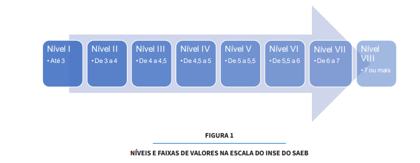

\newpage

# Sumário

1.  [Introdução](#introdução)
2.  [Objetivos](#objetivos)
3.  [Metodologia](#metodologia)
4.  [Resultados](#resultados)
5.  [Discussão](#discussão)
6.  [Conclusão](#conclusão)

\newpage

# Introdução {#introdução}

O Sistema de Avaliação da Educação Básica (Saeb), realizado periodicamente pelo Instituto Nacional de Estudos e Pesquisas Educacionais Anísio Teixeira (Inep) desde os anos 1990, tem objetivos fundamentais no contexto da Educação Básica no Brasil:

1.  Avaliar a Qualidade, Equidade e Eficiência da Educação: O Saeb visa avaliar a qualidade do ensino em seus diferentes níveis governamentais, buscando identificar possíveis disparidades e garantir a eficiência do sistema educacional.

2.  Produzir Indicadores Educacionais: O sistema gera indicadores educacionais para o Brasil, suas regiões, Unidades da Federação, e, quando possível, para municípios e instituições escolares. Isso permite manter a comparabilidade dos dados ao longo do tempo, facilitando o acompanhamento das séries históricas.

3.  Subsidiar Políticas Públicas Baseadas em Evidências: Os dados coletados são utilizados para elaborar, monitorar e aprimorar políticas públicas na área educacional. Essas políticas visam promover o desenvolvimento social e econômico do país.

4.  Desenvolver Competência Técnica e Científica em Avaliação Educacional: O Saeb contribui para o desenvolvimento de competências técnicas e científicas na área de avaliação educacional, promovendo o intercâmbio entre instituições educacionais, de ensino e pesquisa.

O Saeb avalia, de forma amostral e censitária, alunos de turmas regulares das redes públicas e privadas do país, tanto em áreas urbanas quanto rurais. São avaliados os alunos do 5º e 9º anos do ensino fundamental e das 3ª/4ª séries do ensino médio, nas modalidades tradicional e técnico integrado. A partir de 2019, foram adicionadas avaliações amostrais para o 2º ano do ensino fundamental em Língua Portuguesa e Matemática, além do 9º ano em Ciências Humanas e Ciências da Natureza.

Além disso, a partir de 2021, o Saeb inclui uma avaliação amostral bianual da educação infantil. Esta avaliação visa verificar as condições de infraestrutura física, quadro de pessoal, gestão, recursos pedagógicos e acessibilidade, com base nos parâmetros nacionais de qualidade. Os dados são coletados eletronicamente através de respostas de gestores escolares e profissionais da educação infantil, responsáveis pelas atividades em creches e pré-escolas. Os resultados da Avaliação da Educação Infantil são divulgados em microdados específicos.

Essas avaliações são essenciais para compreender e melhorar o sistema educacional brasileiro, proporcionando informações valiosas para a tomada de decisões e a implementação de políticas educacionais mais eficazes.

# Objetivos {#objetivos}

## Objetivo Geral

O objetivo deste trabalho é obter compreensões mais profundas sobre o Relatório de Dados do Saeb realizado em 2021, utilizando análises estatísticas descritivas e a elaboração de gráficos. Dessa forma, será colocado em prática o conhecimento da linguagem de programação R e suas bibliotecas adquirido em aula.

# Metodologia {#metodologia}

As análises foram feitas a partir dos Microdados da Pesquisa do Saeb de 2021. A planilha de dados analisada foi o arquivo TS_ESCOLA.csv, que continha os dados gerais da pesquisa em cada escola.

Foram utilizados os scripts fornecidos pelo próprio INEP para a adequação dos dados para análise, assim como o Dicionário Saeb, que explicava o significado de cada coluna do banco de dados. Para as análises, foram utilizadas as ferramentas RStudio (Versão 4.3.3) e R, além das bibliotecas tidyverse e ggplot2. O relatório foi elaborado através do R Markdown nativo do RStudio.

# Resultados e Discussão {#resultados}

As primeiras análises realizadas visaram obter um panorama geral dos dados em relação a parâmetros mais gerais utilizados na pesquisa, como a região do país de cada escola, sua localidade (urbana ou rural), se a escola era pública ou privada e a área (interior ou capital).

```{r carregar-libraries, echo=FALSE, message=FALSE}
library(ggplot2)
library(tidyverse)
```

##### **GRÁFICO 1**

```{r echo=FALSE, message=FALSE, warning=TRUE}

TS_ESCOLA <- data.table::fread(input='TS_ESCOLA.csv',integer64='character')

TS_ESCOLA$ID_REGIAO <- factor(TS_ESCOLA$ID_REGIAO, levels = c(1,2,3,4,5),
                               labels = c( 'Norte', 'Nordeste', 'Sudeste', 'Sul', 'Centro-Oeste'))
 
 TS_ESCOLA$ID_UF <- factor(TS_ESCOLA$ID_UF, levels = c(11,12,13,14,15,16,17,21,22,23,24,25,26,27,28,29,31,32,33,35,41,42,43,50,51,52,53),
                           labels = c( 'RO', 'AC', 'AM', 'RR', 'PA', 'AP', 'TO', 'MA', 'PI', 'CE', 'RN', 'PB', 'PE', 'AL', 'SE', 'BA', 'MG', 'ES', 'RJ', 'SP', 'PR', 'SC', 'RS', 'MS', 'MT', 'GO', 'DF'))
 
 TS_ESCOLA$ID_AREA <- factor(TS_ESCOLA$ID_AREA, levels = c(1,2),
                             labels = c( 'Capital', 'Interior'))
 
 TS_ESCOLA$IN_PUBLICA <- factor(TS_ESCOLA$IN_PUBLICA, levels = c(0,1),
                                        labels = c('Privada','P?blica'))
 
 TS_ESCOLA$ID_LOCALIZACAO <- factor(TS_ESCOLA$ID_LOCALIZACAO, levels = c(1,2),
                                    labels = c('Urbana', 'Rural'))

 #Plotando a relação de escolas por região do Brasil
 
 contagem1 <- TS_ESCOLA %>%
   count(ID_REGIAO) %>%
   mutate(Porcentagem = n / sum(n) * 100) %>%
   arrange(desc(ID_REGIAO))  
 
 ggplot(contagem1, aes(x = "", y = Porcentagem, fill = factor(ID_REGIAO))) +
   geom_bar(width = 1, stat = "identity") +
   coord_polar(theta = "y") +
   theme_void() +
   geom_text(aes(label = paste0(round(Porcentagem, 1), "%")), position = position_stack(vjust = 0.5)) +
   scale_fill_manual(values = c("#BFD3E6", "#FFD700", "#FFA07A", "#CFCFC4", "#90EE90")) +  # Definir cores para cada ID_AREA
   labs(title = "Distribuição de localidade das Escolas por Região do País",
        fill = "Regiões",
        caption = "Baseado nos dados dO Saeb")
 
  contagem1
```

##### **TABELA 1**

```{r echo=FALSE, message=FALSE, warning=FALSE}
contagem1
```

##### **GRAFICO 2**

```{r echo=FALSE, message=FALSE, warning=FALSE}
 #Plotando a relação escolas e area
 contagem2 <- TS_ESCOLA %>%
   count(ID_AREA) %>%
   mutate(Porcentagem = n / sum(n) * 100) %>%
   arrange(desc(ID_AREA)) 
 
 ggplot(contagem2, aes(x = "", y = Porcentagem, fill = factor(ID_AREA))) +
   geom_bar(width = 1, stat = "identity") +
   coord_polar(theta = "y") +
   theme_void() +
   geom_text(aes(label = paste0(round(Porcentagem, 1), "%")), position = position_stack(vjust = 0.5)) +
   scale_fill_manual(values = c("#e31a1c", "#ff7f00")) +  # Definir cores para cada ID_AREA
   labs(title = "Distribuição de localidade das Escolas por área",
        fill = "Local",
        caption = "Baseado nos dados de TS_ESCOLA")
 

```

##### **TABELA 2**

```{r echo=FALSE}
contagem2
```

##### **GRÁFICO 3**

```{r echo=FALSE, message=FALSE, warning=FALSE}
#Plotando a relação escola pública e privada
 
 contagem3 <- TS_ESCOLA %>%
   count(IN_PUBLICA) %>%
   mutate(IN_PUBLICA = ifelse(IN_PUBLICA == "P?blica", "Publica", "Matemática")) %>%
   mutate(Porcentagem = n / sum(n) * 100) %>%
   arrange(desc(IN_PUBLICA))  # Ordenar por ID_AREA, se necessário
 
 ggplot(contagem3, aes(x = "", y = Porcentagem, fill = factor(IN_PUBLICA))) +
   geom_bar(width = 1, stat = "identity") +
   coord_polar(theta = "y") +
   theme_void() +
   geom_text(aes(label = paste0(round(Porcentagem, 1), "%")), position = position_stack(vjust = 0.5)) +
   scale_fill_manual(values = c("#E75480", "#F4A7B9")) +  # Definir cores para cada ID_AREA
   labs(title = "Distribuição dos tipos de Escolas",
        fill = "Tipo",
        caption = "Baseado nos dados de TS_ESCOLA")
 
```

##### **TABELA 3**

```{r echo=FALSE, message=FALSE, warning=FALSE}
contagem3
```

##### **GRÁFICO 4**

```{r echo=FALSE, message=FALSE, warning=FALSE}
 #Plotando a relação de Localização
 
 contagem4 <- TS_ESCOLA %>%
   count(ID_LOCALIZACAO) %>%
   mutate(Porcentagem = n / sum(n) * 100) %>%
   arrange(desc(ID_LOCALIZACAO))
 
 ggplot(contagem4, aes(x = "", y = Porcentagem, fill = factor(ID_LOCALIZACAO))) +
   geom_bar(width = 1, stat = "identity") +
   coord_polar(theta = "y") +
   theme_void() +
   geom_text(aes(label = paste0(round(Porcentagem, 1), "%")), position = position_stack(vjust = 0.5)) +
   scale_fill_manual(values = c("#1B9E77", "#A1D99B")) +  
   labs(title = "Distribuição das Escolas Por Localização",
        fill = "Localização",
        caption = "Baseado nos dados de TS_ESCOLA")
 
```

##### **TABELA 5**

```{r}
contagem4
```

Esses gráficos nos fornecem informações gerais sobre as escolas onde a pesquisa foi realizada. Observamos um predomínio das regiões Sudeste e Nordeste, que juntas compõem mais de 60% do total de escolas (Gráfico 1). Há também uma predominância de escolas localizadas em municípios do interior em comparação com as capitais (Gráfico 2). Isso pode ser explicado pela distribuição populacional nos municípios. De acordo com o Censo Demográfico de 2022 do Instituto Brasileiro de Geografia e Estatística (IBGE), 23% da população brasileira vive em capitais.

A pesquisa foi integralmente realizada em escolas públicas, embora o banco de dados contemplasse outras possíveis respostas para essa pergunta (Gráfico 3). Quanto à localização das escolas, após análise, ficou claro que 24,2% delas estão em áreas rurais, enquanto 75,8% estão em áreas urbanas (Gráfico 4).

Para uma segunda análise, foi avaliada a adequação da formação dos docentes para cada ano escolar abordado pela pesquisa. Esses resultados foram quantificados por meio de um índice pelos responsáveis pela pesquisa e posteriormente ilustrados através de um boxplot.

##### **GRÁFICO 6**

```{r echo=FALSE, message=FALSE, warning=FALSE}
 ggplot() +
   geom_boxplot(data = TS_ESCOLA, aes(x = "Formação docente EF Iniciais", y = PC_FORMACAO_DOCENTE_INICIAL), width = 0.5, fill = "#1f78b4", color = "black") +
   geom_boxplot(data = TS_ESCOLA, aes(x = "Formação docente EF Finais", y = PC_FORMACAO_DOCENTE_FINAL), width = 0.5, fill = "#112446", color = "black") +
   geom_boxplot(data = TS_ESCOLA, aes(x = "Formação docente EM", y = PC_FORMACAO_DOCENTE_MEDIO), width = 0.5, fill = "#6A0DAD", color = "black") +
   theme_minimal() +
   labs(title = "Boxplots Adequação da Formação dos professores",
        subtitle = "Baseado no índice de adequação da Formação.",
        x = "Anos Escolares",
        y = "Valor índice de adequação") +
   scale_x_discrete(labels = c("Formação docente EF Iniciais" = "Anos Iniciais do EF", "Formação docente EF Finais" = "Anos finais do EF", "Formação docente EM" = "Ensino Medio"))
 
 quartis <- data.frame(
   Variavel = c("Formação docente nos anos Iniciais", "Formação docente anos finais", "Formação docentes EM"),
   Q25 = c(quantile(TS_ESCOLA$PC_FORMACAO_DOCENTE_INICIAL, probs = 0.25, na.rm = TRUE),
           quantile(TS_ESCOLA$PC_FORMACAO_DOCENTE_FINAL, probs = 0.25, na.rm = TRUE),
           quantile(TS_ESCOLA$PC_FORMACAO_DOCENTE_MEDIO, probs = 0.25, na.rm = TRUE)),
   Mediana = c(quantile(TS_ESCOLA$PC_FORMACAO_DOCENTE_INICIAL, probs = 0.5, na.rm = TRUE),
               quantile(TS_ESCOLA$PC_FORMACAO_DOCENTE_FINAL, probs = 0.5, na.rm = TRUE),
               quantile(TS_ESCOLA$PC_FORMACAO_DOCENTE_MEDIO, probs = 0.5, na.rm = TRUE)),
   Q75 = c(quantile(TS_ESCOLA$PC_FORMACAO_DOCENTE_INICIAL, probs = 0.75, na.rm = TRUE),
           quantile(TS_ESCOLA$PC_FORMACAO_DOCENTE_FINAL, probs = 0.75, na.rm = TRUE),
           quantile(TS_ESCOLA$PC_FORMACAO_DOCENTE_MEDIO, probs = 0.75, na.rm = TRUE))
 )
 

                                              
```

##### TABELA 5

```{r echo=FALSE, message=FALSE, warning=FALSE}
quartis
```

Através desses dados (Tabela 5), podemos observar que entre os anos escolares, há uma maior defasagem na adequação da formação dos docentes nos anos finais do Ensino Fundamental. Em contrapartida, os anos iniciais do Ensino Fundamental apresentam maior adequação da formação de forma geral (Gráfico 5).

Os dados da pesquisa incluem também a taxa de participação dos estudantes nas escolas, um dado de grande importância para os objetivos da pesquisa, pois indica a participação em cada escola e pode fornecer insights sobre possíveis motivos para os resultados encontrados.

Para analisar esses dados, calculou-se a média da taxa de participação das escolas para cada ano escolar. Essas médias foram agrupadas em uma tabela e em seguida gerou-se um gráfico de barras para uma melhor visualização dos dados. No caso do Ensino Médio, as escolas foram divididas entre Ensino Médio Tradicional, Integrado e apenas Ensino Médio.

##### **TABELA 6**

```{r echo=FALSE, message=FALSE, warning=FALSE}
 
mediatxp5 <- mean(TS_ESCOLA$TAXA_PARTICIPACAO_5EF, na.rm = T)
 mediatxp9 <- mean(TS_ESCOLA$TAXA_PARTICIPACAO_9EF, na.rm = T)
 mediatxpEMT <- mean(TS_ESCOLA$TAXA_PARTICIPACAO_EMT, na.rm = T)
 mediatxpEMI <- mean(TS_ESCOLA$TAXA_PARTICIPACAO_EMI, na.rm = T)
 mediatxpEM <- mean(TS_ESCOLA$TAXA_PARTICIPACAO_EM, na.rm = T)
 
 datatx <-  data.frame(Ano_escolar = c("5º Ano EF", "9º Ano EF", "EM Tradicional","EM Integrado", "Ensino Medio"),
                       TaxaP_Saeb = c(mediatxp5, mediatxp9, mediatxpEMT, mediatxpEMI, mediatxpEM))
 
 datatx
```

##### GRÁFICO 6

```{r echo=FALSE, message=FALSE, warning=FALSE}
datatx$TaxaP_Saeb_perc <- datatx$TaxaP_Saeb / max(datatx$TaxaP_Saeb) * 100
   
 ggplot(datatx, aes(x = Ano_escolar, y = TaxaP_Saeb_perc)) +
   geom_col(position = position_dodge(width = 0.3), width = 0.5, fill = "#1f78b4", color = "white") +  # geom_col para gráfico de barras com cor de preenchimento e borda
   theme_minimal() +  # Estilo do tema
   labs(title = "Média das Taxas de Participação da pesquisa por Ano Escolar",
        x = "Ano Escolar",
        y = "Taxa de participação (%)")
```

A taxa de participação na pesquisa apresenta uma queda significativa entre os anos iniciais e o ensino médio (Gráfico 6) embora siga centro padrão dentre as modalidades de Ensino Médio e os anos do Ensino Fundamental.

Ao analisar as médias das notas obtidas pelos alunos nas escolas em Português e Matemática, podemos correlacioná-las com as regiões do Brasil, obtendo assim um panorama nacional dos resultados.

##### **GRÁFICO 7**

```{r echo=FALSE, warning=FALSE}
##Médias Quinto ano 
 
MEDIA_5EF <- TS_ESCOLA %>%
  pivot_longer(cols = c(MEDIA_5EF_LP, MEDIA_5EF_MT),
               names_to = "Disciplina",
               values_to = "Media") %>%
  mutate(Disciplina = ifelse(Disciplina == "MEDIA_5EF_LP", "Língua Portuguesa", "Matemática"))

ggplot(MEDIA_5EF, aes(x = ID_REGIAO, y = Media, fill = Disciplina)) +
  geom_col(position = "dodge") +
  theme_minimal() +
  labs(title = "Médias em Língua Portuguesa e Matemática no 5º ano",
       x = "Região",
       y = "Média",
       fill = "Disciplina") +
  scale_fill_manual(values = c("#112446","#2a9d8f"))


```

##### **GRÁFICO 8**

```{r}##Médias Nono ano}

MEDIA_9EF <- TS_ESCOLA %>%
  pivot_longer(cols = c(MEDIA_9EF_LP, MEDIA_9EF_MT),
               names_to = "Disciplina",
               values_to = "Media") %>%
  mutate(Disciplina = ifelse(Disciplina == "MEDIA_9EF_LP", "Língua Portuguesa", "Matemática"))

ggplot(MEDIA_9EF, aes(x = ID_REGIAO, y = Media, fill = Disciplina)) +
  geom_col(position = "dodge") +
  theme_minimal() +
  labs(title = "Médias em Língua Portuguesa e Matemática no 9º ano",
       x = "Região",
       y = "Média",
       fill = "Disciplina") +
  scale_fill_manual(values = c("#FF5733", "#FFC300"))


```

##### GRÁFICO 9

```{r}
##Médias Ensino Médio Tradicional

MEDIA_EMT <- TS_ESCOLA %>%
  pivot_longer(cols = c(MEDIA_EMT_LP, MEDIA_EMT_MT),
               names_to = "Disciplina",
               values_to = "Media") %>%
  mutate(Disciplina = ifelse(Disciplina == "MEDIA_EMT_LP", "Língua Portuguesa", "Matemática"))

ggplot(MEDIA_EMT, aes(x = ID_REGIAO, y = Media, fill = Disciplina)) +
  geom_col(position = "dodge") +
  theme_minimal() +
  labs(title = "Médias em Língua Portuguesa e Matemática no Ensino Médio Tradicional",
       x = "Região",
       y = "Média",
       fill = "Disciplina") +
  scale_fill_manual(values = c("#6A0DAD", "#C77FF2"))

```

##### **GRÁFICO 10**

```{r}
##Médias Ensino Médio Integrado

MEDIA_EMI <- TS_ESCOLA %>%
  pivot_longer(cols = c(MEDIA_EMI_LP, MEDIA_EMI_MT),
               names_to = "Disciplina",
               values_to = "Media") %>%
  mutate(Disciplina = ifelse(Disciplina == "MEDIA_EMI_LP", "Língua Portuguesa", "Matemática"))

ggplot(MEDIA_EMI, aes(x = ID_REGIAO, y = Media, fill = Disciplina)) +
  geom_col(position = "dodge") +
  theme_minimal() +
  labs(title = "Médias em Língua Portuguesa e Matemática no Ensino Médio Integrado",
       x = "Região",
       y = "Média",
       fill = "Disciplina") +
  scale_fill_manual(values = c("#1B9E77", "#A1D99B"))


```

##### GRÁFICO 11

```{r}

##Médias Ensino Médio 

MEDIA_EM <- TS_ESCOLA %>%
  pivot_longer(cols = c(MEDIA_EM_LP, MEDIA_EM_MT),
               names_to = "Disciplina",
               values_to = "Media") %>%
  mutate(Disciplina = ifelse(Disciplina == "MEDIA_EM_LP", "Língua Portuguesa", "Matemática"))

ggplot(MEDIA_EM, aes(x = ID_REGIAO, y = Media, fill = Disciplina)) +
  geom_col(position = "dodge") +
  theme_minimal() +
  labs(title = "Médias em Língua Portuguesa e Matemática no Ensino Médio",
       x = "Região",
       y = "Média",
       fill = "Disciplina") +
  scale_fill_manual(values = c("#E75480", "#F4A7B9"))
```

Os valores indicam uma melhor nota média dos alunos na Região Nordeste nos anos iniciais do Ensino Fundamental (Gráfico 7). O Nordeste continua ocupando posição de destaque junto com a região Norte nos anos finais do Ensino Fundamental (Gráfico 8). Já nos anos finais dos três tipos de Ensino Médio, há um maior equilibrio entre as regiões Nordeste, Sudeste e Sul. O Centro-Oeste se matém um pouco à baixo enquanto a região Norte, performa nota média dos alunos nas disciplinas bem abaixo das demais regiões (Gráficos 9, 10 e 11)

Ao encarar as questões socioeconômicas podemos analisar de forma geral o padrão socioeconômico dos participantes. A imagem a seguir (Imagem 1) representa a divisão realizada pelo INEP entre os níveis socioeconômicos



O gráfico à seguir denota as proporções de cada nível socioeconômico nas escolas:

# Conclusão {#conclusão}

Resuma as principais conclusões obtidas com o estudo realizado.
